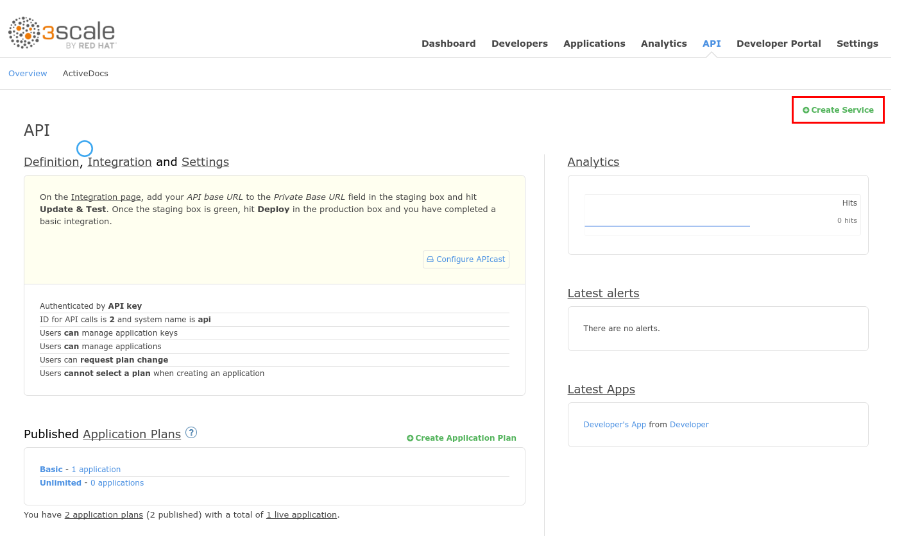
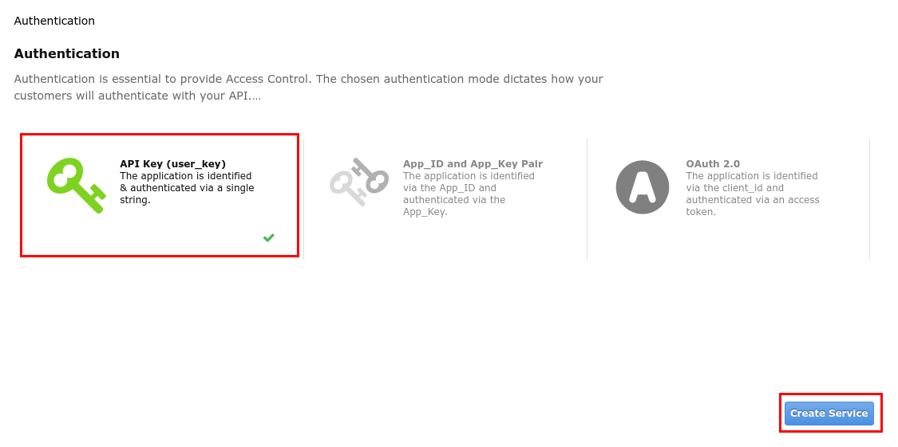
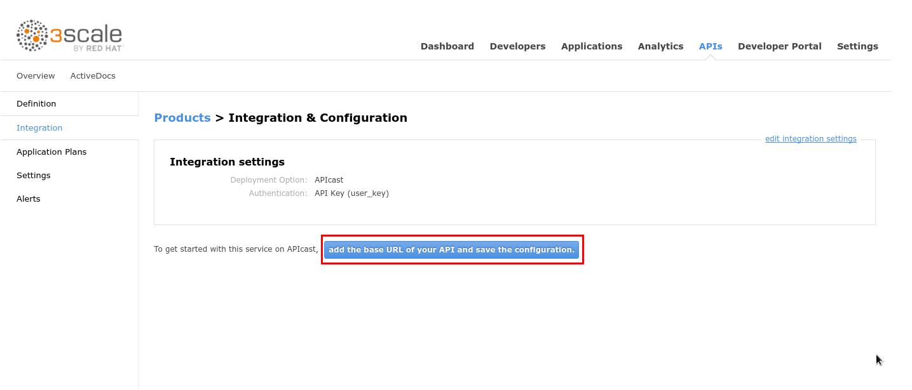
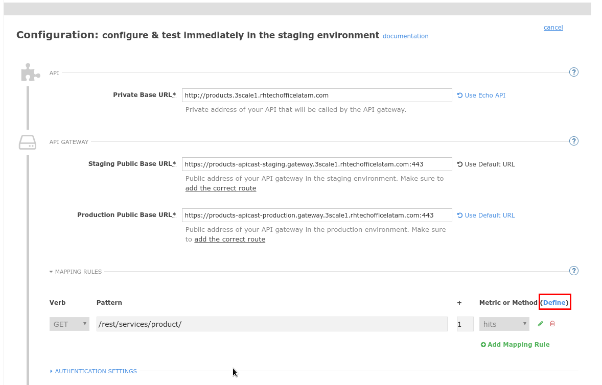
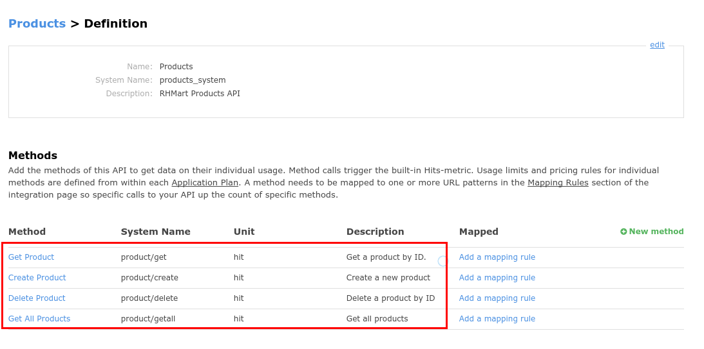
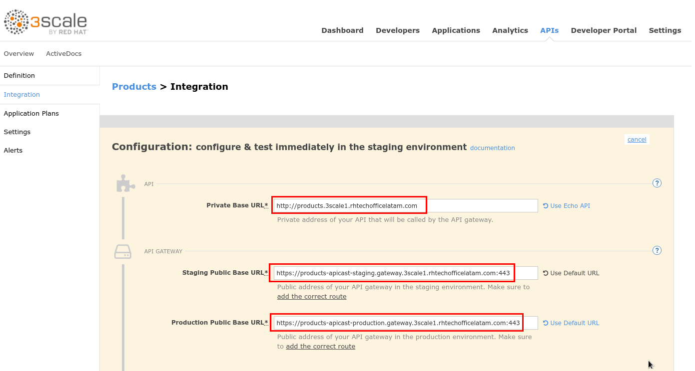

# Lab 2 - Create your first API {#lab-2-create-your-first-api}

|  | In this lab, you will create your first API in 3Scale API Management, exposing a REST JEE application which is running in a JBoss Enterprise Application Platform (EAP) container in the same OCP cluster. |
| --- | --- |

1.  Open a new web browser tab.
2.  Go to https://3scale-admin.3scale.{{ book.suffix }}.
3.  Login as admin/admin
4.  If a “connection not private” warning appears, click on Proceed to ..
5.  Login with admin/admin.

1.  Click on the grey X to dismiss the Getting started wizard.

1.  Notice there is a pre-built API called “API” that is useful for learning/testing.

1.  Click on the Create Service link.

1.  Enter the following values:

1.  Name: Products
2.  System Name: products_system
3.  Description: RHMart Products API

1.  Scroll down to the bottom of the page, and make sure API Key is selected as authentication method.
2.  Click on the Create Service button.

1.  In the APIs section, expand the Products API and scroll down to the Published Application Plans section.
2.  Click on the Create Application Plan link.

1.  Enter the following values:

1.  Name: ProductsBasicPlan
2.  System Name: products/basic

1.  Click on the Create Application Plan button.

1.  Click on the Create Application Plan link.

1.  Enter the following values:

1.  Name: ProductsPremiumPlan
2.  System Name: products/premium

1.  Click on the Create Application Plan button.

1.  Select the ProductsBasicPlan as Default Plan.
2.  Click on the Publish link for both Basic and Premium plans.

|  | Plans are used for granting access to specific APIs and endpoints, limiting traffic and monetizing API usage. Application plans let you configure access rights to an API by specifying rate limits and pricing rules. All applications must be associated with a plan. Application plans can be customized for one application. |
| --- | --- |

1.  Click on the Developers tab.
2.  Click on the Create link.

1.  Enter the following values:

1.  Username: rhbankdev
2.  Email: developer@rhbank.com
3.  Password: rhbank
4.  Organization: RHBank

1.  Click on the 1 Application breadcrumb.
2.  Notice there is one default application for the built-in “API” service.

1.  Click on the Create Application link.
2.  Enter the following values:

1.  Application Plan: ProductsBasicPlan
2.  Name: ProductsApp
3.  Description: Products Application

1.  Click on the Create Application button.

1.  Click on the APIs tab.
2.  Expand the Products API and click on Integration.

1.  Click on the add the base URL of your API and save the configuration button.

1.  Expand the Mapping Rules section.
2.  Click on the Define Metric/Method  link.

1.  Click on the New Method link in the Methods section.

1.  Enter the following values:

1.  Friendly Name: Get Product
2.  System Name: product/get
3.  Description: Get a product by ID.

1.  Click on the Create Method button.

1.  Repeat this procedure for the following methods:

| Friendly Name | System Name | Description |
| --- | --- | --- |
| Create Product | product/create | Create a new Product |
| Delete Product | product/delete | Delete a product by ID |
| Get All Products | product/getall | Get all products |

1.  Click on any of the “Add a Mapping rule” links.
2.  Click on the edit icon next to the GET mapping rule.
3.  Enter /rest/services/product/ as the Pattern.
4.  Select product/get as Method.

1.  Click on the Add Mapping Rule link.
2.  Repeat this procedure for the following values:

| Verb | Pattern | Method |
| --- | --- | --- |
| POST | /rest/services/product | product/create |
| DELETE | /rest/services/product/ | product/delete |
| GET | /rest/services/products | product/getall |

1.  Open a new web browser tab, and go to [https://threescale.3scale[your instance #].rhtechofficelatam.com:8443/console/](https://www.google.com/url?q=https://threescale.3scale1.rhtechofficelatam.com:8443/console/&sa=D&ust=1530635179318000) 
2.  Click on the Products API project.

1.  Take note of the Products API http route. It should be http://products.3scale[ your instance #].rhtechofficelatam.com

|  | The Products API is a restful service built on Java (JAX-RS), deployed on JBoss EAP and connected to a PostgreSQL DB. |
| --- | --- |

1.  Go back to 3Scale web browser tab.
2.  Enter the following values:

1.  Private Base URL:  http://products.3scale[ your instance #].rhtechofficelatam.com
2.  Staging Public Base URL: https://products-apicast-staging.gateway.3scale[ your instance #].rhtechofficelatam.com:443
3.  Production Public Base URL: https://products-apicast-production.gateway.3scale[ your instance #].rhtechofficelatam.com:443

1.  Scroll down to the API Test GET request.
2.  Enter  /rest/services/product/1.
3.  Click on the Update &amp; Test in Staging Environment.

1.  You should get a success message.
2.  Click on  the Back to Integration &amp; Configuration link.

1.  Select the URL after “curl” and copy it.

1.  Open a new web browser tab, and paste the URL.
2.  You should get a json document describing a product.

