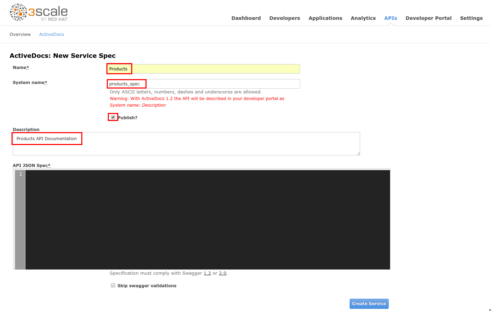
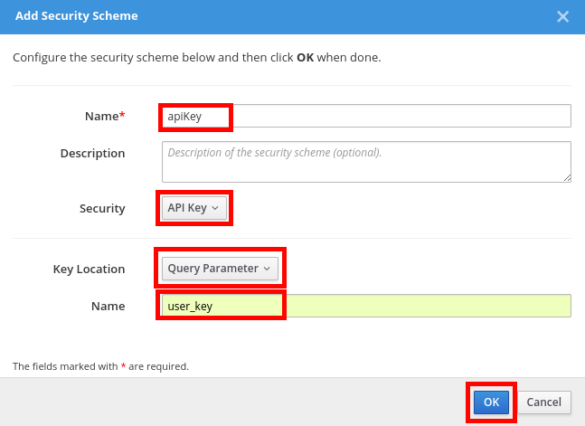
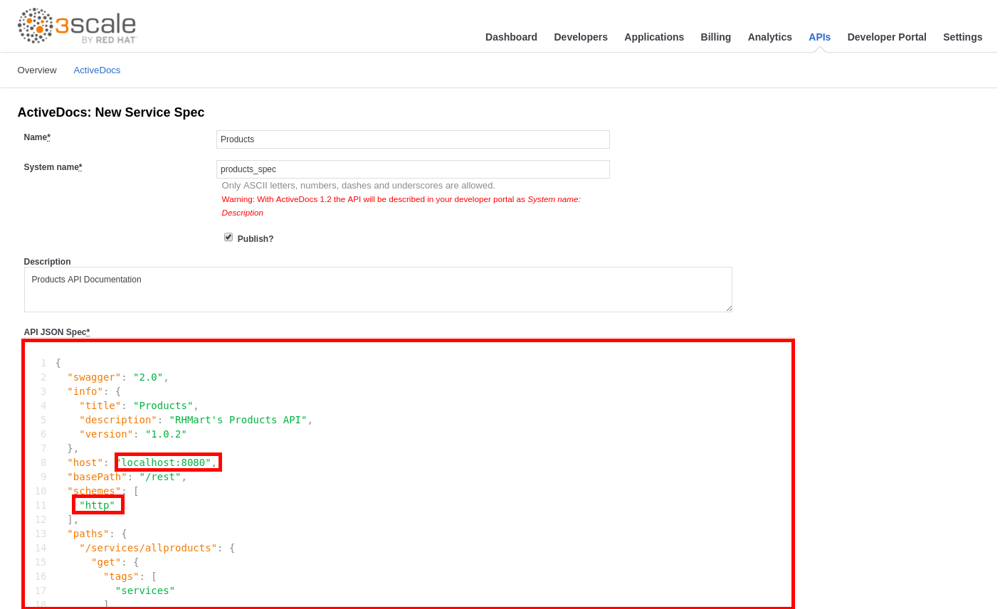
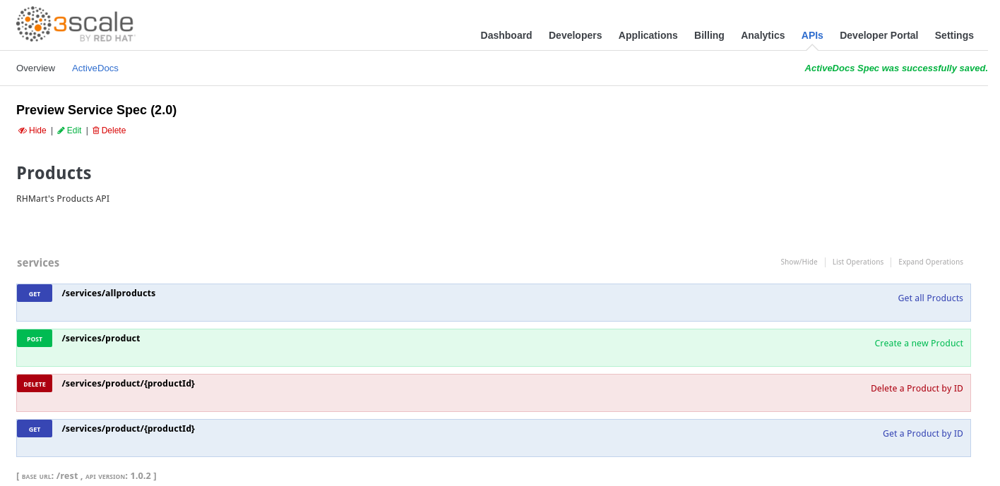
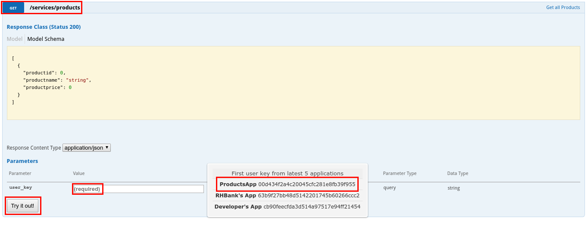

# Lab 4 - API Documentation {#lab-4-api-documentation}


In this lab, you will generate and test an ActiveDocs documentation for the API created in the 2nd lab.


*  Open a web browser and go to https://3scale-admin.3scale.{{ book.suffix }}
*  Login as admin/admin
*  Click on the **APIs** tab.
*  Click on the **AciveDocs** link.

*  Click on the **Create a new spec**.

*  Enter the following values:
| Parameter | Value |
| --- | --- |
| **Name** | Products |
| **System Name** | products_spec |
| **Publish?** | checked |
| **Description** | Products API Documentation |

* Open a new web browser tab, and go to http://apicurio-studio.{{ book.suffix }}
* Click on the **Register** link.

* Complete the form with the following values:
| Parameter | Value |
| --- | --- |
| **First Name** | Username |
| **Last Name** | Lastname |
| **Email** | user@mail.com |
| **Password** | password |
| **Confirm Password** | password |
* Click on the **Register** button.

* Click on the **Import API** button.

* Enter the following URL:  http://products.{{ book.suffix }}/rest/swagger.yaml
* Click on the **Import API** button.

* Click on the **Edit API** button.


You will add a "security scheme" to the API to secure it using API Keys.


* Click on the **Add a security scheme** link.

* Enter the following values:

| Parameter | Value |
| -- | -- |
| **Name** | apiKey |
| **Security** | API Key |
| **Key Location** | Query Parameter |
| **Name** | user_key |

* Click on the **OK** button.

* Click on the **Add security requirement** link.

* Check the **apiKey** security requirement.
* Click on the **OK** button.

* Click on the APIs >> **Products** breadcrumb link.
* Click on the three dots in the **̈́Products** API and select **Download (JSON)**.

* Save the **Products.json** file.
* Go back to the 3Scale admin console web browser tab.
* Open the downloaded **Products.json** file with any text editor, and copy its contents.
* Paste it into the API JSON Spec field.

* Replace **host** field value with: **products-apicast-staging.3scale.{{book.suffix }}:443**
* Change the **http** scheme to **https**.
* Scroll down to the bottom of the page, and click on the **Create Service** button.

* Click on the **Applicatios** tab.
* Click on the **ProductsApp** application.
* Copy the **User Key** under **API Credentials**

* Click on the **APIs** tab.
* Click on the **ActiveDocs** tab.
* Click on the **Products** spec.

* Expand the **GET** **/services/allproducts** operation.
* Click on the red circle with an exclamation sign.
* Paste the **User Key** into the **value** field.
* Click on the **Authorize** button.

2.  Go to the **Parameters** section.
3.  Click on the user_key value field.
4.  Select the ProductsApp user_key.

1.  Click on the Try it Out! Button.
2.  You should get a successful response like the following:

1.  If you get a “No Content” error, copy the displayed URL, open a new tab and paste the URL.
2.  Accept the certificate.
3.  Close the tab and test the API again.