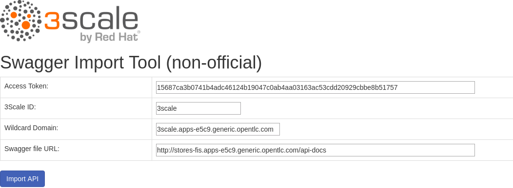
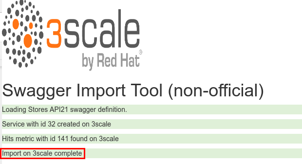
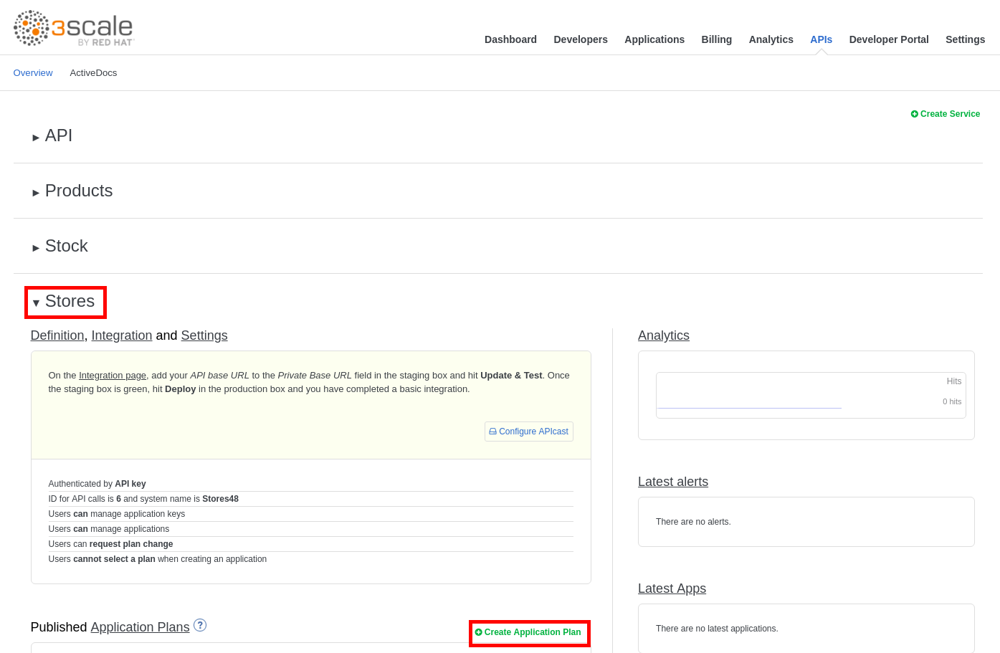
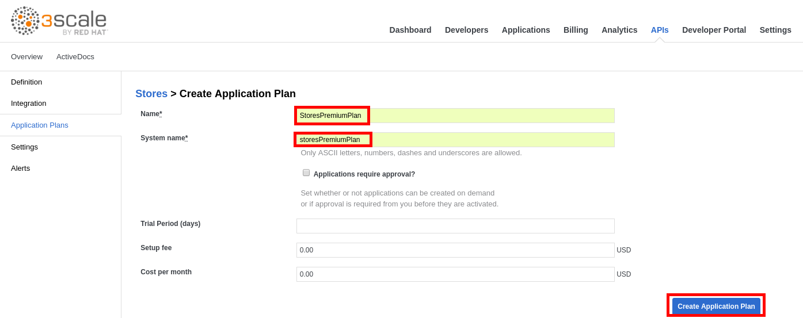
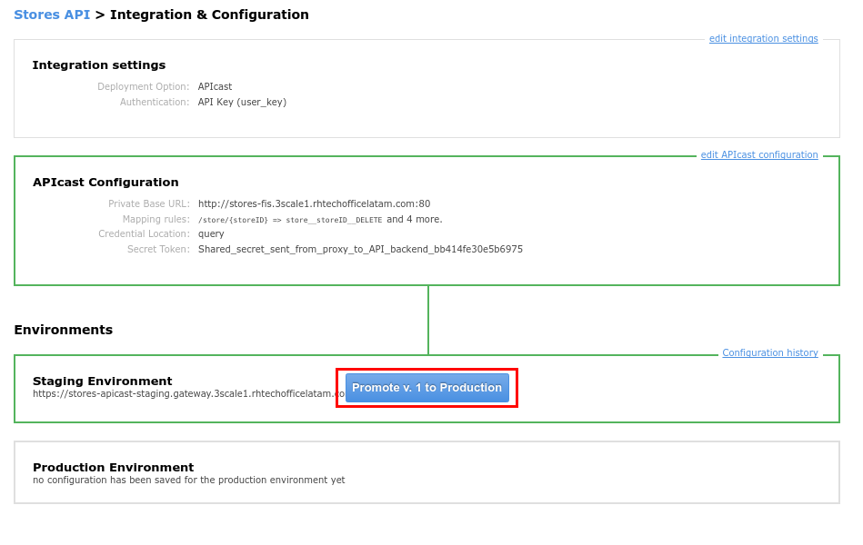
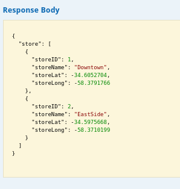

## Create the Stores API

* Go to https://3scale-admin.3scale.{{ book.suffix }}
* Click on the **configuration** icon.
* Click on **Personal Settings**.


* Click on the **Tokens** tab.
* Click on the **Add Access Token** link.


* Enter **Name**: importer
* Check on the three scopes.
* Select Permission: **Read &amp; Write**
* Click on the **Create Access Token **button.


* Select and copy the generated **Token**.


* Open a new web browser tab and go to http://swagger-import.{{ book.suffix }}
* Enter the following values:

| Parameter | Value |
| --- | --- |
| **Access Token** | &lt;paste the copied Token&gt; |
| **3Scale ID** | 3scale |
| **Wildcard Domain** | 3scale.{{ book.suffix }} |
| **Swagger File URL** | http://stores-fis.{{ book.suffix }}/api-docs|

* Click on the **Import API** button.



* After a couple of seconds, the import process should be done.



* Close the browser tab.
* Go back to  https://3scale-admin.{{ book.suffix }}
* Click on the **APIs** tab.
* Expand **Stores API**.
* Click on the **Create Application Plan** link



* Enter the following values:
    * **Name**: StoresPremiumPlan
    * **System Name**: storesPremiumPlan

* Click on the **Create Application Plan** button.



* Click on the **Publish** link.


* Click on the **Developers** tab.
* Click on the **RHBank** account.


* Click on the **3 Applications** Breadcrumb.
* Click on the **Create Application** link.


* Select the **StoresPremiumPlan**.
* Enter the following values:
    * **Name**: storesApp
    * **Description**: Stores Application

* Click on the **Create Application** button.


* Click on the **Stores** API link.


* Click on the **Integration** tab.
* Click on the **add the base URL of your API and save the configuration** button.


* Enter the following values:

    * **Private Base URL**: http://stores-fis.{{ book.suffix }}
    * **Staging Public Base URL**: https://stores-apicast-staging.3scale.{{ book.suffix }}
    * **Production Public Base URL**: https://stores-apicast-production.3scale.{{ book.suffix }}
    * **API test GET request**: /allstores
    * **Policy Chain**: CORS

* Click on the **Update &amp; test in Staging Environment** button.



You should receive a successful validation.


* Click on the **Back to Integration &amp; Configuration** link.


* Click on the **Promote v1 to Production** button.



* Click on the **ActiveDocs** tab.
* Click on the **Edit** icon for the **Stores** spec.


* Change the host attribute to: **stores-apicast-production.3scale.{{ book.suffix }}**
* Change the scheme from _http_ to _https_.
* For each of the _four_ **user_key** parameters, add the following attribute: 

```
,"x-data-threescale-name": "user_keys"

```


* Scroll down to the bottom of the page and click on the **Update Service** button.


This property that was added to the parameteres, enables API Key auto-completion in ActiveDocs.


* Open a web browser tab and go to https://stores-apicast-production.3scale.{{ book.suffix }} and accept the SSL certificate.
* Close the tab and go back to the **Stores** API ActiveDoc.
* Expand the **/allstores** operation.
* Click on the **user_key** parameter field and select the **storesApp** user key.
* Click on the **Try it out!** button.



You should receive a JSON document with a list of stores.


