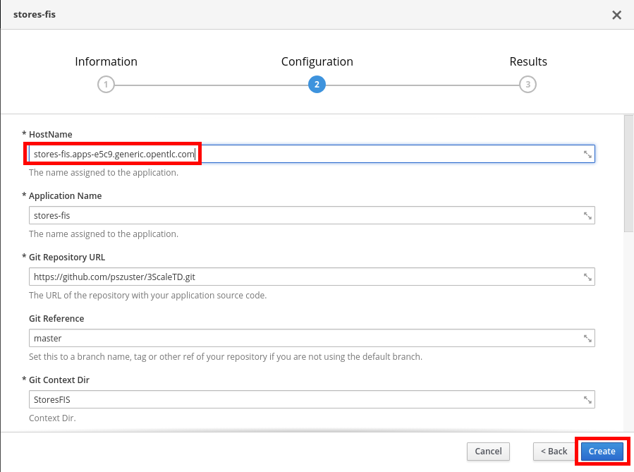

##  Deploy the Fuse REST API

* Close the browser tab, and go back to OpenShift console.
* Make sure you are in the **Stores API **project.
* Click on the **Add to project ** dropdown button.
* Click on **Browse Catalog**.

* Select the **stores-fis** template.
* Click on the **Next>** button.
* Change the **HostName** parameter to: stores-fis.{{ book.suffix }}
* Click on the **Create** button.

* Click on the **Continue to project overview **link.
* After ~3min the Fuse Integration Services container should be up and running (there should be a blue circle).


This Fuse Integration Services container has a SpringBoot Camel route that transforms REST requests to SOAP requests, and XML SOAP responses to JSON documents. It was created using a wizard in JBoss Developer Studio: [demo](https://vimeo.com/279892542).


<iframe src="https://player.vimeo.com/video/279892542" width="640" height="360" frameborder="0" webkitallowfullscreen mozallowfullscreen allowfullscreen></iframe>

<a href="https://vimeo.com/279892542">3scale Test Drive - Lab7 -SOAP to REST wizard</a> from <a href="https://vimeo.com/user75822429">Pablo Szuster</a> on <a href="https://vimeo.com">Vimeo</a>.

* Open a new web browser tab, and go to http://stores-fis.{{ book.suffix }}/allstores/
* You should receive a JSON document generated from the SOAP response.
* Close the tab.
