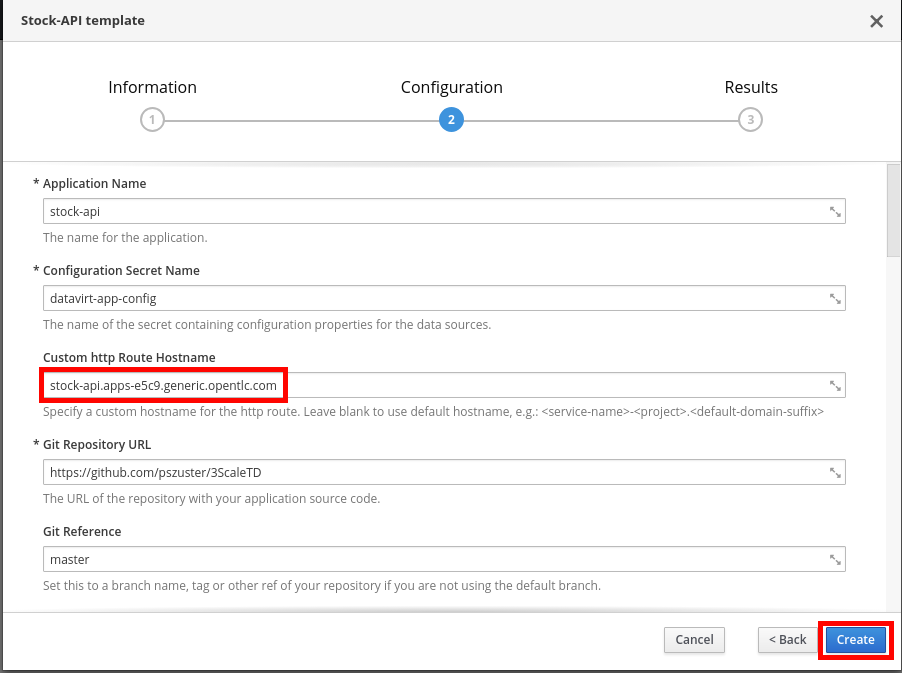

# Lab 8 - Exposing an OData Service with JDV {#lab-8-exposing-an-odata-service-with-jdv}


In this lab you will deploy an OData service based on a JBoss DataVirtualization for Openshift (JDV) virtual database (VDB).  This VDB has a virtual view that retrieves data from two databases’ tables (MySQL and PostreSQL) and present them as a single SQL ANSI table. Then, out of the box, this view is exposed in JDV as an OData REST service. You can find more info about JDV here: https://www.redhat.com/en/technologies/jboss-middleware/data-virtualization


* Open a web browser and go to https://{{ book.hostname }}:8443/
* Login as admin/admin
* Select the **Stock API** project.
* Click on the **Browse Catalog** button.

* Select the **Stock-API** template.
* Click on the **Next >** button.
* Set the **Custom http Route Hostname** field to: stock-api.{{ book.suffix }}
* Scroll down to the bottom of the page and click on the **Create** button.

* Click on the **Continue to the project overview** link.
* After ~5min, a **JBoss Data Virtualization** service will be deployed to OpenShift along with two databases: a **MySQL** and a **PostgreSQL** instance.

* When the three circles are blue, open a new web browser tab and go to http://stock-api.{{ book.suffix }}/odata4/Stock-API/FederatedStock/stock?$format=JSON.


You should receive a JSON document with Stock information coming from the Virtual DataBase(VDB) deployed in the JBoss Data Virtualization container. The VDB has a stock table with federated data from the mysql and postgresql databases.



JDV is a data integration tool that allows you to connect to different data sources in real time and present a unified SQL view to the data consumer. (more info: https://www.redhat.com/en/technologies/jboss-middleware/data-virtualization
)


* Go to https://3scale-admin.3scale.{{ book.suffix }} 
* Login as admin/admin
* Click on the **APIs** tab.
* Click on the **Create Service** link.

1.  Enter the following values:

1.  Name: Stock API
2.  System Name: stock-api
3.  Description: Stock API

1.  Scroll down to the bottom of the page and click on the Create Service button.
2.  Click on the Create Application Plan link.

1.  Enter the following values:

1.  Name: StockPremiumPlan
2.  System Name: stockPremiumPlan

1.  Click on the Create Application Plan button.

1.  Click on the Publish link.
2.  Click on the Developers tab.
3.  Click on the RHBank account.

1.  Click on the  4 Applications breadcrumb.
2.  Click on the Create Application link.

1.  Enter the following values:

1.  Application Plan: StockPremiumPlan
2.  Name: StockApp
3.  Description: Stock Application

1.  Click on the Create Application button.

1.  Click on the Stock API link.
2.  Click on the Integration tab.
3.  Click on the add the base URL of your API and save the configuration button.

1.  Enter the following values:

1.  Private Base URL: [http://stock-api.3scale[your instance #].rhtechofficelatam.com](https://www.google.com/url?q=http://stock-api.3scale1.rhtechofficelatam.com&sa=D&ust=1530635179422000) 
2.  Staging Public Base URL: https://stock-apicast-staging.gateway.3scale[your instance #].rhtechofficelatam.com:443
3.  Production Public Base URL: [https://stock-apicast-production.gateway.3scale[your instance #].rhtechofficelatam.com:443](https://www.google.com/url?q=https://stock-apicast-production.gateway.3scale1.rhtechofficelatam.com:443&sa=D&ust=1530635179423000)

1.  Click on the edit icon next to the GET operation under Mapping Rules.
2.  Enter /odata4/Stock-API/FederatedStock/stock as the Pattern.
3.  Enter /odata4/Stock-API/FederatedStock/stock?$format=JSON in the API test GET request.
4.  Click on the Update &amp; test in the Staging Environment.

1.  Click on the Back to Integration &amp; Configuration link.
2.  Click on the  Promote v.1 to Production button.

|  | OData URLs in JDV are formed using the following syntax: |
| --- | --- |

1.  Click on the ActiveDocs tab.

1.  Click on the Create a new spec link.
2.  Enter the following values:

1.  Name: Stock API
2.  System Name: stockApiSpec

1.  Open a new web browser tab and go to [https://raw.githubusercontent.com/pszuster/3ScaleTD/master/Stock/stock-api-swagger.json](https://www.google.com/url?q=https://raw.githubusercontent.com/pszuster/3ScaleTD/master/Stock/stock-api-swagger.json&sa=D&ust=1530635179428000)
2.  Copy the contents of the json file (Ctrl+A, Ctrl+C).
3.  Close the browser tab.
4.  Paste the json file to the  API JSON Spec field.
5.  Change the host attribute to [stock-apicast-production.gateway.3scale[your instance #].rhtechofficelatam.com](https://www.google.com/url?q=https://stock-apicast-production.gateway.3scale1.rhtechofficelatam.com:443&sa=D&ust=1530635179429000),  to match your instance #.

1.  Scroll down to the bottom of the page and click on the Create Service button.
2.  Click on the Publish button.

1.  Open a web browser tab.
2.  Go to https://stock-apicast-production.gateway.3scale[your instance #].rhtechofficelatam.com/odata4/Stock-API/FederatedStock/stock
3.  Accept the SSL Certificate.
4.  Close the tab and go back to 3Scale’s tab.
5.  Expand the /stock operation.
6.  Enter JSON in the $format field.
7.  Click on the user_key field and select the StockApp user key.
8.  Click on the Try it out! button.

1.  You should receive an OData JSON document.
2.  Enter “productid eq 1” in the $filter field.
3.  Click on the Try it out! button.

1.  You should receive an OData filtered JSON document.

|  | The $filter field specifies a “WHEN” condition for the query, “productid” is one of the columns of the virtual view, and “eq 1” means “=1”. |
| --- | --- |