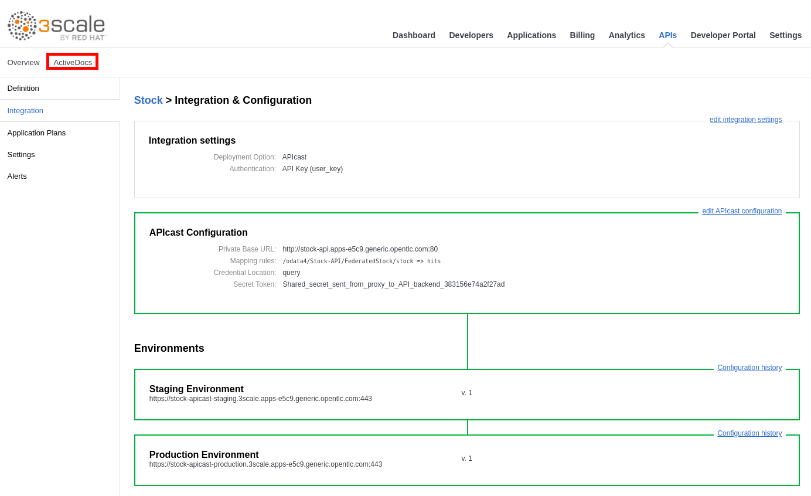

# Lab 8 - Exposing an OData Service with JDV {#lab-8-exposing-an-odata-service-with-jdv}


In this lab you will deploy an OData service based on a JBoss DataVirtualization for Openshift (JDV) virtual database (VDB).  This VDB has a virtual view that retrieves data from two databases’ tables (MySQL and PostreSQL) and present them as a single SQL ANSI table. Then, out of the box, this view is exposed in JDV as an OData REST service. You can find more info about JDV here: https://www.redhat.com/en/technologies/jboss-middleware/data-virtualization


* Open a web browser and go to https://{{ book.hostname }}:8443/
* Login as admin/admin
* Select the **Stock API** project.
* Click on the **Browse Catalog** button.

* Select the **Stock-API** template.
* Click on the **Next >** button.
* Set the **Custom http Route Hostname** field to: stock-api.{{ book.suffix }}
* Scroll down to the bottom of the page and click on the **Create** button.

* Click on the **Continue to the project overview** link.
* After ~5min, a **JBoss Data Virtualization** service will be deployed to OpenShift along with two databases: a **MySQL** and a **PostgreSQL** instance.

* When the three circles are blue, open a new web browser tab and go to http://stock-api.{{ book.suffix }}/odata4/Stock-API/FederatedStock/stock?$format=JSON.


You should receive a JSON document with Stock information coming from the Virtual DataBase(VDB) deployed in the JBoss Data Virtualization container. The VDB has a stock table with federated data from the mysql and postgresql databases.



JDV is a data integration tool that allows you to connect to different data sources in real time and present a unified SQL view to the data consumer. (more info: https://www.redhat.com/en/technologies/jboss-middleware/data-virtualization
)


* Go to https://3scale-admin.3scale.{{ book.suffix }} 
* Login as admin/admin
* Click on the **APIs** tab.
* Click on the **Create Service** link.

* Enter the following values:

| Parameter | Value |
| --- | --- |
| **Name** | Stock |
| **System Name** | stock-api |
| **Description** | Stock API |

* Scroll down to the bottom of the page and click on the **Create Service** button.
* Click on the **Create Application Plan** link.

*  Enter the following values:
    * **Name**: StockPremiumPlan
    * **System Name**: stockPremiumPlan

* Click on the **Create Application Plan** button.

* Click on the **Publish** link.
* Click on the **Developers** tab.
* Click on the **RHBank** account.

* Click on the **4 Applications** breadcrumb.
* Click on the **Create Application** link.

* Enter the following values:

| Parameter | Value |
| --- | --- |
| **Application Plan** | StockPremiumPlan |
| **Name** | StockApp |
| **Description** | Stock Application |

* Click on the **Create Application** button.

* Click on the **Stock** API link.
* Click on the **Integration** tab.
* Click on the **add the base URL of your API and save the configuration** button.

* Enter the following values:

    * **Private Base URL**: http://stock-api.{{ book.suffix }}
    * **Staging Public Base URL**: https://stock-apicast-staging.3scale.{{ book.suffix }}
    * **Production Public Base URL**: https://stock-apicast-production.3scale.{{ book.suffix }}
* Click on the **edit** icon next to the **GET** operation under **Mapping Rules**.
* Enter **/odata4/Stock-API/FederatedStock/stock** as the **Pattern**.
* Add a **CORS** Policy.
* Enter **/odata4/Stock-API/FederatedStock/stock?$format=JSON** in the **API test GET request**.
4.  Click on the **Update &amp; test in the Staging Environment** button.

* Click on the **Back to Integration &amp; Configuration** link.
* Click on the **Promote v.1 to Production** button.


[OData](http://www.odata.org/) URLs in JDV are formed using the following syntax:
/odata[4]/[VDB_Name]/[ModelName]/[ViewName]


* Click on the **ActiveDocs** tab.

* Click on the **Create a new spec** link.
* Enter the following values:
    * **Name**: Stock API
    * **System Name**: stockApiSpec

* Open a new web browser tab and go to [https://raw.githubusercontent.com/pszuster/3ScaleTD/master/Stock/stock-api-swagger.json](https://raw.githubusercontent.com/pszuster/3ScaleTD/master/Stock/stock-api-swagger.json)
* Copy the contents of the json file (Ctrl+A, Ctrl+C).
* Close the browser tab.
* Paste the json file to the **API JSON Spec** field.
* Change the **host** attribute to stock-apicast-production.3scale.{{ book.suffix }}

* Scroll down to the bottom of the page and click on the** Create Service** button.
* Click on the **Publish** button.

* Open a web browser tab.
* Go to https://stock-apicast-production.3scale.{{ book.suffix }}/odata4/Stock-API/FederatedStock/stock
* Accept the SSL Certificate.
* Close the tab and go back to 3Scale’s tab.
* Expand the **/stock** operation.
* Enter **JSON** in the **$format** field.
* Click on the **user_key** field and select the **StockApp** user key.
* Click on the **Try it out!** button.


You should receive an OData JSON document.


*  Enter “**productid eq 1**” in the **$filter** field.
*  Click on the **Try it out!** button.


You should receive an OData filtered JSON document.



The **$filter** field specifies a “WHEN” condition for the query, “**productid**” is one of the columns of the virtual view, and “eq 1” means “=1”. 
