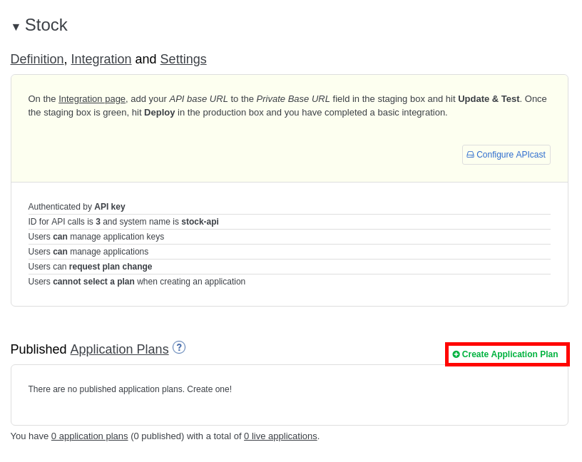
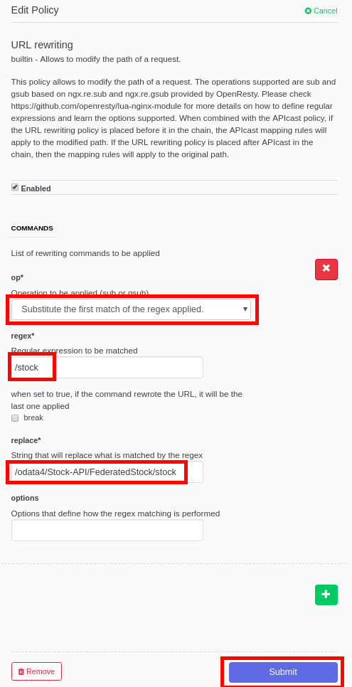
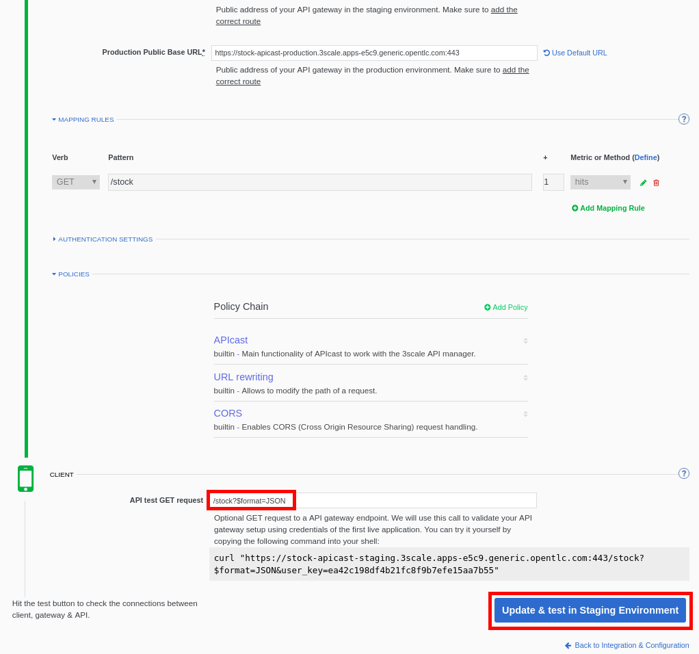
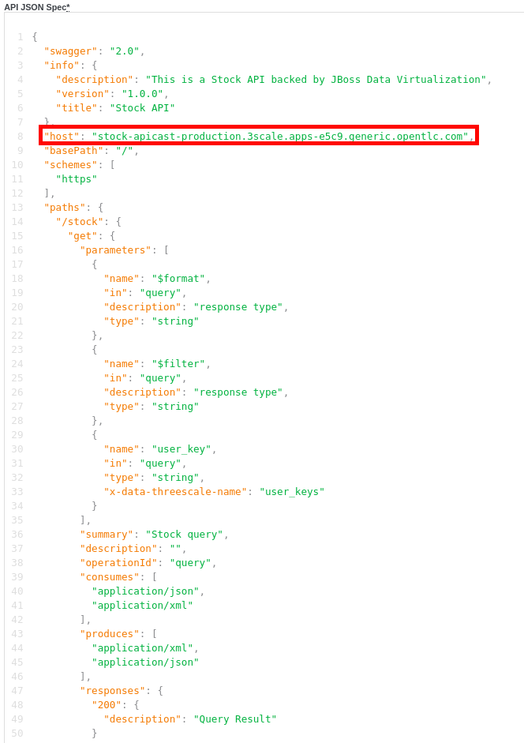
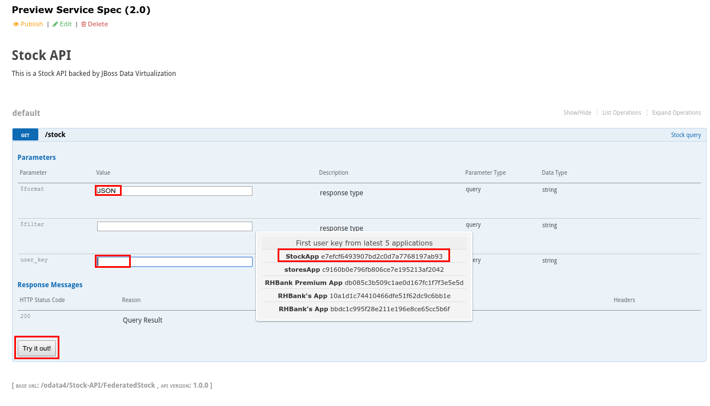

## Create the Stock API

* Go to https://3scale-admin.3scale.{{ book.suffix }} 
* Login as admin/admin
* Click on the **APIs** tab.
* Click on the **Create Service** link.

* Enter the following values:

| Parameter | Value |
| --- | --- |
| **Name** | Stock |
| **System Name** | stock-api |
| **Description** | Stock API |

* Scroll down to the bottom of the page and click on the **Create Service** button.
* Click on the **Create Application Plan** link.

*  Enter the following values:
    * **Name**: StockPremiumPlan
    * **System Name**: stockPremiumPlan

* Click on the **Create Application Plan** button.

* Click on the **Publish** link.
* Click on the **Developers** tab.
* Click on the **RHBank** account.

* Click on the **4 Applications** breadcrumb.
* Click on the **Create Application** link.

* Enter the following values:

| Parameter | Value |
| --- | --- |
| **Application Plan** | StockPremiumPlan |
| **Name** | StockApp |
| **Description** | Stock Application |

* Click on the **Create Application** button.
* Click on the **Stock** API link.
* Click on the **Integration** tab.
* Click on the **add the base URL of your API and save the configuration** button.

* Enter the following values:

    * **Private Base URL**: http://stock-api.{{ book.suffix }}
    * **Staging Public Base URL**: https://stock-apicast-staging.3scale.{{ book.suffix }}
    * **Production Public Base URL**: https://stock-apicast-production.3scale.{{ book.suffix }}
* Click on the **edit** icon next to the **GET** operation under **Mapping Rules**.
* Enter **/stock** as the **Pattern**.

* Expand the **Policies** section.
* Click on **Add Policy**.
* Add a **CORS** Policy.
* Click on **Add Policy** again.
* Select **URL Rewriting**.
* Move the **URL Rewriting** Policy below **APIcast** (and above **CORS**).


You have to drag and drop the small arrow icons in the right side of the policy


* Click on the **URL Rewriting** Policy.
* Click on the **+** icon.
* Enter the following values:

| Parameter | Value |
| --- | --- |
| **op*** | Substitute the first match of the regex applied |
| **regex*** | /stock | 
| **replace*** | /odata4/Stock-API/FederatedStock/stock |

* Click on the **Submit** button.

* Enter **/stock?$format=JSON** in the **API test GET request**.
* Click on the **Update &amp; test in the Staging Environment** button.

* Click on the **Back to Integration &amp; Configuration** link.
* Click on the **Promote v.1 to Production** button.


[OData](http://www.odata.org/) URLs in JDV are formed using the following syntax:
/odata[4]/[VDB_Name]/[ModelName]/[ViewName]


* Click on the **ActiveDocs** tab.

* Click on the **Create a new spec** link.
* Enter the following values:
    * **Name**: Stock
    * **System Name**: stockApiSpec

* Open a new web browser tab and go to [https://raw.githubusercontent.com/pszuster/3ScaleTD/master/Stock/stock-api-swagger.json](https://raw.githubusercontent.com/pszuster/3ScaleTD/master/Stock/stock-api-swagger.json)
* Copy the contents of the json file (Ctrl+A, Ctrl+C).
* Close the browser tab.
* Paste the json file to the **API JSON Spec** field.
* Change the **host** attribute to stock-apicast-production.3scale.{{ book.suffix }}

* Scroll down to the bottom of the page and click on the** Create Service** button.
* Click on the **Publish** button.

* Open a web browser tab.
* Go to https://stock-apicast-production.3scale.{{ book.suffix }}/stock
* Accept the SSL Certificate.
* Close the tab and go back to 3Scale’s tab.
* Expand the **/stock** operation.
* Enter **JSON** in the **$format** field.
* Click on the **user_key** field and select the **StockApp** user key.
* Click on the **Try it out!** button.


You should receive an OData JSON document.


*  Enter “**productid eq 1**” in the **$filter** field.
*  Click on the **Try it out!** button.


You should receive an OData filtered JSON document.



The **$filter** field specifies a “WHEN” condition for the query, “**productid**” is one of the columns of the virtual view, and “eq 1” means “=1”. 
