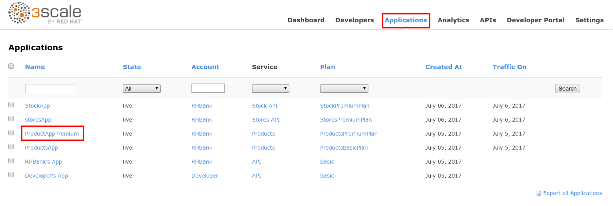
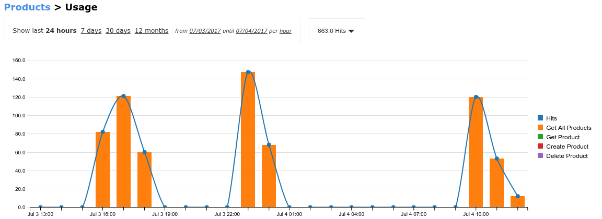
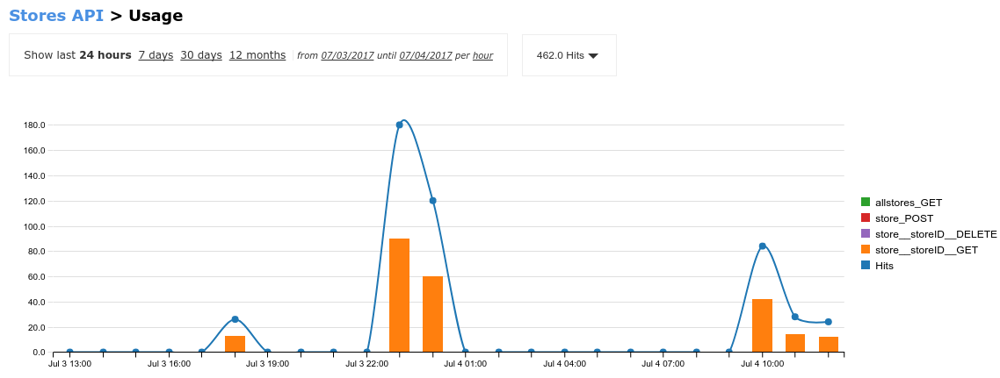
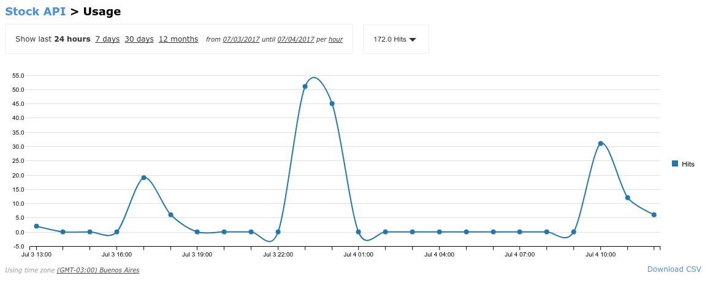
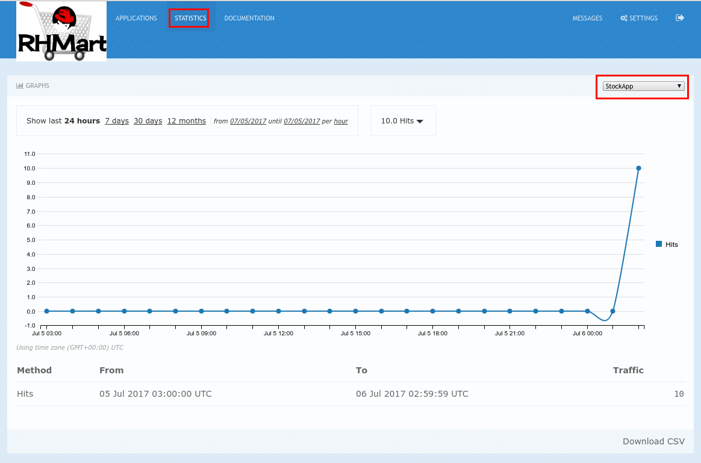

# Lab 9 - Sample Application {#lab-9-sample-application}


In this lab you will deploy a really simple nodeJS web application that simulates a business partner of the owner of the API that uses the 3 APIs configured in the previous labs, to generate value. 


|  | The Benefits web app, will first invoke the Products API’s “getAll” operation to retrieve the entire list of products. Then, when the user clicks on a product, it will invoke the Stock API’s “stock” operation filtered by productid, which will return the list of store ids,with their amount of stock available. Finally the app will invoke the Stores API’s “store/{storeID}” operation for each store to retrieve the store’s name and geolocation, to place it on the map. |
| --- | --- |

1.  Open a web browser and go to [https://threescale.3scale[your instance #].rhtechofficelatam.com:8443/](https://www.google.com/url?q=https://threescale.3scale1.rhtechofficelatam.com:8443/&sa=D&ust=1530635179447000) 
2.  Login as admin/admin
3.  Click on the New Project button.

1.  Enter the following values:

1.  Name: benefits
2.  Display Name:  Benefits

1.  Click on the Create button.

1.  Enter “benefits” in the Browse Catalog search field.
2.  Click on the Select button in the found template.

1.  Scroll down to the middle of the page, and enter:

1.  Application Hostname: benefits.3scale[your instance #].rhtechofficelatam.com

1.  Set the following values:

1.  Products API URL: [https://products-apicast-staging.gateway.3scale[your instance #].rhtechofficelatam.com:443/rest/services/products](https://www.google.com/url?q=https://products-apicast-staging.gateway.3scale.rhtechofficelatam.com:443/rest/services/products&sa=D&ust=1530635179450000) 
2.  Stock API URL: [https://stock-apicast-production.gateway.3scale[your instance #].rhtechofficelatam.com/odata4/Stock-API/FederatedStock/stock](https://www.google.com/url?q=https://stock-apicast-production.gateway.3scale1.rhtechofficelatam.com/odata4/Stock-API/FederatedStock/stock&sa=D&ust=1530635179450000) 
3.  Stores API URL: [https://stores-apicast-production.gateway.3scale[your instance #].rhtechofficelatam.com/store/](https://www.google.com/url?q=https://stores-apicast-production.gateway.3scale1.rhtechofficelatam.com/store/&sa=D&ust=1530635179451000) 

1.  Open a new web browser tab (don’t close this one!).
2.  Go to [https://3scale-admin.3scale[your instance #].rhtechofficelatam.com](https://www.google.com/url?q=https://3scale-admin.3scale1.rhtechofficelatam.com&sa=D&ust=1530635179451000) 
3.  Login as admin/admin
4.  Click on the Applications tab.
5.  Click on the ProductsAppPremium.

1.  Select and copy the User Key.

1.  Go back to the Openshift console tab.
2.  Paste the user key, in the Products API Key parameter.

1.  Go back to the 3Scale dashboard’s browser tab.
2.  Click on the Applications tab.
3.  Click on the storesApp application.
4.  Select and copy the User Key.

1.  Switch back to the Openshift console browser tab.
2.  Paste the user key to the Stores API Key.

1.  Go back to the 3Scale dashboard’s browser tab.
2.  Click on the Applications tab.
3.  Click on the StockApp application.
4.  Select and copy the User Key.

1.  Switch back to the Openshift console browser tab.
2.  Paste the user key to the Stock API Key.

1.  Click on the Create button.
2.  Click on the Continue to overview link.
3.  After ~2min, there should be a nodeJS container deployed to Openshift.
4.  Click on the route.

1.  Click on any Product from the products table.

1.  It should invoke the Stock API to query about stores with stock available for that products, and invoke the Stores API to retrieve their name/location.
2.  You can review the nodejs code of the Benefits App here: [https://github.com/pszuster/3ScaleTD/blob/master/Benefits/views/index.html](https://www.google.com/url?q=https://github.com/pszuster/3ScaleTD/blob/master/Benefits/views/index.html&sa=D&ust=1530635179456000)
3.  Switch back to the 3Scale dashboard’s browser tab.
4.  Click on the Analytics tab.
5.  Click on the Products API, Stores API and Stock API.
6.  You should see the traffic created by the Benefits application (specifically for the “Get All Products”, “store_storeID_GET” and stock “Hits” operations.

1.  Open a web browser tab and go to [https://3scale.3scale[your instance #].rhtechofficelatam.com](https://www.google.com/url?q=https://3scale.3scale3.rhtechofficelatam.com&sa=D&ust=1530635179457000) 
2.  Click on the Statistics tab.
3.  Cycle through the involved plans to view the API activity (ProductAppPremium, storesApp, StockApp).

